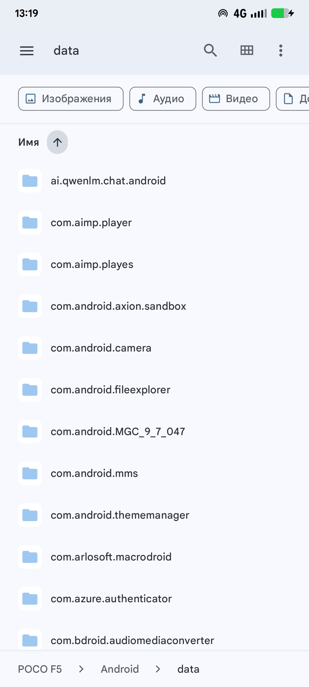

# sdcardfs Restore

Zygisk-модуль, возвращающий внутренней памяти поведение Android 10 и более
ранних версий: **прямой доступ ко всей памяти для всех приложений без
исключений**, без FUSE и без scoped storage.

Списка приложений нет и быть не должно — подмена выполняется для каждого
процесса, который запускает Zygote.

У модуля два пути к одной цели:

* **основной** — sdcardfs с маской `0007` и `gid=9997`;
* **альтернативный** — сырое дерево `/data/media` с POSIX ACL на ту же группу
  `9997`. Включается сам, когда в ядре нет `CONFIG_SDCARD_FS`.

Какой путь сработал, видно в логе: `sdcardfs подключён` либо
`сырой /data/media подключён`.

* Устройство проверки: POCO F5 (marble), Android 16, ядро 5.10 с
  `CONFIG_SDCARD_FS`.
* Версия: **v2.6.1**

---

## 1. Что делает модуль

Ровно две вещи:

1. В `preAppSpecialize()` создаёт процессу приватный mount namespace и
   подкладывает под `/mnt/user/<user>/emulated` источник памяти. Дальше Zygote
   сам рекурсивно биндит `/mnt/user/<user>` на `/storage`, поэтому подмена
   оказывается и на `/storage/emulated`.
2. Сбрасывает `*args->mount_storage_dirs` в `false`. Штатно Zygote накрывает
   `/storage/emulated/<user>/Android/{data,obb}` временным tmpfs и биндит туда
   каталоги **только своего пакета**; флаг отключает эту изоляцию, и
   `Android/data` с `Android/obb` отдаются целиком.

Всё остальное — вспомогательные скрипты, без которых эти две вещи не заработают
(см. §3).

## 2. Механика

```
preAppSpecialize(args)
  ├─ mount_external ∈ {DEFAULT, ANDROID_WRITABLE}?   иначе выход
  ├─ unshare(CLONE_NEWNS)
  ├─ mount(NULL, "/", MS_REC|MS_PRIVATE)
  ├─ attach("/mnt/user/<user>/emulated")
  │    ├─ bind /mnt/runtime/full/emulated  -> statfs == 0x5dca2df5 ?
  │    │     да  -> основной путь
  │    │     нет -> umount2(MNT_DETACH) и дальше
  │    └─ bind /data/media                 -> statfs == 0x65735546 (FUSE) ?
  │          нет -> альтернативный путь;  да -> откат, процесс без подмены
  ├─ (ANDROID_WRITABLE) то же для /mnt/androidwritable/<user>/emulated
  └─ *args->mount_storage_dirs = JNI_FALSE
```

Источник выбирается **по факту, а не по конфигу**: проверяется не успех
`mount(2)`, а тип ФС, реально оказавшейся под точкой (`statfs`). Без sdcardfs в
ядре `storage.sh` смонтировать его не может, и bind подсунул бы пустой каталог —
`statfs` это ловит, маунт откатывается и берётся сырое дерево. Такой же откат
страхует от того, чтобы приложение осталось вообще без памяти.

Обрабатываются два режима внешнего хранилища:

| режим | кто | обрабатывается |
|---|---|---|
| `DEFAULT` (1) | все обычные приложения | да |
| `ANDROID_WRITABLE` (4) | приложения с `MANAGE_EXTERNAL_STORAGE` и провайдер SAF `com.android.externalstorage`, через который ходит системное приложение «Файлы» | да |
| `NONE` (0) | изолированные процессы — внешнего хранилища у них нет вовсе | нет |
| `INSTALLER` (2) | `installd` | нет |
| `PASS_THROUGH` (3) | MediaProvider — ему нужен сырой `/data/media` | нет |

Последним трём подмена сломала бы сам слой хранилища.

## 3. Почему нужны скрипты

Модуль умеет только подкладывать готовый источник. Поэтому к моменту старта
первого приложения уже должны существовать:

* ярлык `media_rw_data_file` на корне `/data/media`;
* маунты `/mnt/runtime/*/emulated` — для основного пути;
* ACL на дереве `/data/media` — для альтернативного.

Всем этим занимается `module/storage.sh`, который вызывают `post-fs-data.sh` (до
Zygote) и `service.sh` (повторно, после vold). Шаги идемпотентны.

### 3.1. Маунты `/mnt/runtime/*/emulated`

На этой прошивке `external_storage.sdcardfs.enabled=0` (задано в
`/vendor/build.prop`), поэтому vold **не** выполняет `/system/bin/sdcard` и
`/mnt/runtime/*/emulated` остаются пустыми каталогами. Модулю нечего
подкладывать — маунты создаёт `storage.sh`.

**Почему не `/system/bin/sdcard`.** AOSP-овский `sdcard.cpp` создаёт реальным
`mount(2)` только `/mnt/runtime/default/emulated`, а `read`/`write`/`full` — через
`sdcardfs_setup_bind_remount()`, то есть bind + `MS_REMOUNT` с новыми
`mask=`/`gid=`. В этом ядре `sdcardfs_remount_fs()` опции не разбирает
(заглушка), а vfsopts живут в superblock, поэтому все четыре маунта получают
опции `default` (`gid=1015`, `mask=6`) и становятся бесполезны для приложений.
Каждый маунт создаётся отдельным `mount(2)` — тогда у каждого свой анонимный
superblock и свои vfsopts.

Опции повторяют `system/core/sdcard/sdcard.cpp` (`mask` печатается в десятичном
виде — там `StringPrintf("mask=%d", mask)` над octal-литералом):

| точка | `mask` | `gid` |
|---|---|---|
| `default` | `6` (oct 0006) | `1015` AID_SDCARD_RW |
| `read` | `23` (oct 0027) | `9997` AID_EVERYBODY |
| `write` | `7` (oct 0007) | `9997` |
| `full` | `7` (oct 0007) | `9997` |

Модуль берёт именно `full`: драйвер считает права как `0775 & ~mask`, поэтому
каталоги получаются `0770`, файлы `0660`, а `AID_EVERYBODY` есть у любого
процесса. Итог — полный доступ ко всей памяти, включая `Android/data`,
`Android/obb` и каталоги чужих пакетов. Ровно так же вёл себя маунт `full` на
Android 9 и раньше.

### 3.2. Ярлык корня `/data/media`

sdcardfs своих данных не хранит: он пробрасывает операции к нижнему слою
(`/data/media`) и не заводит отдельного инода для корня точки монтирования —
`getattr()` корня форвардится в нижний инод. У этого корня ярлык особый:

```
private/file_contexts:633   /data/media     u:object_r:media_userdir_file:s0
private/file_contexts:634   /data/media/.*  u:object_r:media_rw_data_file:s0
private/domain.te:252       allow { coredomain appdomain } media_userdir_file:dir search;
```

для `media_userdir_file` разрешён ровно один `search`, без `getattr`:

```
stat /storage/emulated    -> Permission denied   (и без единого AVC: dontaudit)
stat /storage/emulated/0  -> ok
```

Содержимое работает и так: там ярлык `media_rw_data_file`, на который у
appdomain полные права (`app.te:149`). А вот сам корень — нет, и это ровно то
ограничение доступа, которого быть не должно.

`storage.sh` возвращает корню ярлык `media_rw_data_file` — тот же, что был у
`/data/media` на Android 10 и раньше (тогда отдельного типа
`media_userdir_file` просто не существовало).

Патчить sepolicy не нужно: право уже есть, а `relabelto` для домена zygote
запрещён neverallow (`domain.te:791`) — поэтому перемаркировка делается
скриптом, а не из процесса приложения.

На альтернативном пути перемаркировка ещё и обязательна: под `/storage/emulated`
ложится само дерево `/data/media`, и без `media_rw_data_file` на его корне
appdomain не получит даже `search`.

### 3.3. Альтернативный путь: ACL на сыром дереве

Когда sdcardfs в ядре нет, под `/mnt/user/<user>/emulated` ложится само
`/data/media`. Это не изобретение модуля: **ровно то же делает AOSP** на
платформе без sdcardfs — `vold-16/Utils.cpp:1691` биндит туда
`absolute_lower_path`, то есть сырое дерево, и отдаёт получившийся
`/mnt/pass_through/<user>/emulated` привилегированным потребителям. Модуль
просто отдаёт этот вид всем приложениям.

Проблема в правах: дерево принадлежит `1023:1023` (`media_rw`) с режимами
`0550` на корне, `2770` на `/data/media/0` и `0670` на файлах, а в группах
приложений `1023` нет. Без правки приложение не войдёт даже в корень.
sdcardfs эту работу делает сам, отдавая каталоги `0770` и файлы `0660` для
`gid 9997`; на альтернативном пути то же самое выставляется POSIX ACL.

**Почему именно 9997.** `AID_EVERYBODY` — «shared between all apps in the same
profile» (`system-core-16/.../android_filesystem_config.h:166`), и это ровно тот
gid, с которым смонтированы sdcardfs-маунты `read`/`write`/`full`
(`system-core-16/sdcard/sdcard.cpp:182`). Доступ получают все приложения, а не
список избранных. Проверено на устройстве: 9997 есть у 78 процессов из 80;
исключения — `99000`/`99001` (`ISOLATED_APP_UID_BASE`), и они же лишены прав на
`media_rw_data_file` в `app.te`.

**Почему ACL, а не chmod.** Две причины:

* `vold` при каждой загрузке пересобирает `/data/media`, `Android`,
  `Android/data`, `Android/obb` и `Android/media` через `fs_prepare_dir()`
  (`chown` + `chmod`). `chmod` правит в ACL только `USER_OBJ`/`GROUP_OBJ`/`MASK`/
  `OTHER` и **не трогает именованные записи** — выданный доступ это переживает.
  Проверено: ACL, расставленные до перезагрузки, остались на месте после неё.
* `umask` приложений — `0077`, он бы обнулял групповые биты у всего, что они
  создают. Но если у каталога есть **default ACL**, ядро вообще не применяет
  umask: `vfs_create()` пропускает `mode &= ~current_umask()`, а
  `posix_acl_create()` считает режим пересечением с ACL
  (`fs/posix_acl.c`, Linux 5.10). Поэтому `storage-fix` пишет и access-, и
  default-ACL: файл, созданный приложением с `0666` и `umask 077`, выходит
  `0660` с унаследованной записью для 9997 — и его сразу видят все приложения.

Утилита `module/tools/storage-fix` (исходник — `tools/storage-fix.c`) строит ACL
ровно по образцу `vold::SetDefaultAcl` (`vold-16/Utils.cpp:142`), но с именованной
записью для 9997:

```
USER_OBJ  <- владелец
GROUP_OBJ <- группа
GROUP     <- 9997        <- то, чего нет у vold
MASK      <- группа      <- без него именованная запись обнулилась бы
OTHER     <- остальные
```

Режимы: каталоги — владелец + `rwx` группе + остальное; файлы — владелец +
`rw` группе (плюс сохранённый `x`) + остальное; корню тома (`--traverse`) —
только `r-x`, его нужно пройти, писать в него нечего. Проход по дереву
`/data/media/0` (1188 каталогов, ~7000 файлов) занимает около секунды.

**Почему шаг выполняется дважды.** `Android/obb` — единственный каталог, у
которого vold **перезаписывает** default ACL
(`SetDefaultAcl(androidObbDir, ..., {})`, `Utils.cpp:1894`), а не просто
`chmod`-ит. Проход на стадии `service` возвращает ACL на место и заодно
накрывает пакеты, чьи каталоги vold создал за это время.

**Как определяется, что путь нужен.** Основной путь считается поднятым, только
если под всеми четырьмя точками `/mnt/runtime/*/emulated` действительно
sdcardfs. Тип берётся из **последней** записи `/proc/mounts` для этого пути:
маунты идут в порядке наложения, поэтому последняя — верхняя, а наивный `grep`
видит и то, что лежит под точкой, и ошибается.

Читается `/proc/mounts` **только средствами шелла**, без `stat(1)`. Это не
придирчивость: на стадиях модуля KernelSU подставляет свой busybox, и его
`stat -f -c %T` печатает `UNKNOWN` вместо магического числа — проверка молча
ломается. Замерено на устройстве в одном и том же окружении:

| | post-fs-data | service |
|---|---|---|
| `stat -f -c %T` (busybox) | каталогов ещё нет | `UNKNOWN` |
| чтение `/proc/mounts` шеллом | пусто | `sdcardfs` |

## 4. Требования

1. Zygisk: Magisk или ZygiskNext (KernelSU/APatch).
2. Android 11+ (проверено на Android 16).
3. Ядро с `CONFIG_SDCARD_FS` — **желательно, но не обязательно**. Без него
   модуль уходит на альтернативный путь; ему нужны `CONFIG_F2FS_FS_POSIX_ACL`
   и `acl` в опциях монтирования `/data` (на современных ядрах так и есть).

## 5. Сборка и установка

```sh
./build.sh                          # arm64-v8a + armeabi-v7a, zip в out/
./build.sh arm64-v8a                # только один ABI
API=30 ./build.sh                   # другой API level (по умолчанию 26)
ZIP=0 ./build.sh                    # не паковать zip
```

Собираются две вещи: `module/zygisk/<abi>.so` (сам модуль) и
`module/tools/storage-fix-<abi>` (утилита ACL, ~7 КБ). В архиве лежат бинарники
утилиты на все ABI, а `customize.sh` при установке оставляет нужный и
переименовывает его в `tools/storage-fix`.

```sh
adb push out/sdcardfs_restore-v2.6.1.zip /data/local/tmp/
adb shell su -c "ksud module install /data/local/tmp/sdcardfs_restore-v2.6.1.zip"
adb reboot
```

Отключить модуль: создать `/data/adb/modules/sdcardfs_restore/disable` и
перезагрузиться (штатный механизм загрузчика — отдельного `config` у модуля нет).

## 6. Проверка

```sh
# 1. какой путь задействован — видно по логу подготовки
cat /data/adb/sdcardfs_restore.log
#    основной:      "основной путь готов: sdcardfs на /mnt/runtime/*/emulated"
#    альтернативный: "основной путь не поднялся — перехожу на альтернативный"
#                    "альтернативный путь: ACL с группой 9997 расставлены"

# 2. маунты: все четыре должны быть sdcardfs с нужными mask/gid
grep mnt/runtime /proc/mounts

# 3. ярлык корня — обязательно media_rw_data_file
ls -Zd /data/media

# 4. что модуль сделал с приложением (одна строка на запуск)
logcat -d | grep SdcardFsRestore
#    I SdcardFsRestore: sdcardfs подключён: uid=10398
#    I SdcardFsRestore: сырой /data/media подключён: uid=10398
```

Полная регрессия обоих путей — `tools/device-test-fallback.sh`: она накрывает
`/mnt/runtime/*/emulated` tmpfs, подменяет `mount(1)` заглушкой (ровно то, что
сделал бы `mount -t sdcardfs` на ядре без этой ФС), прогоняет штатный
`storage.sh`, перезапускает приложение и проверяет доступ от его имени внутри его
namespace, а затем возвращает sdcardfs на место.

```sh
adb push tools/device-test-fallback.sh /data/local/tmp/
adb push <собранный aclprobe> /data/local/tmp/aclprobe
adb shell su -c 'sh /data/local/tmp/device-test-fallback.sh'
```

Ожидаемый результат:

```
основной путь
  /mnt/runtime/full/emulated    sdcardfs
  /storage/emulated/0           statfs=0x5dca2df5
  Android/data                  -> 54 пакета, виден всем
  запись в Download             -> WRITE_OK

альтернативный путь
  E SdcardFsRestore: /mnt/user/0/emulated: под точкой не sdcardfs — откат
  I SdcardFsRestore: сырой /data/media подключён: uid=10419
  /storage/emulated/0           f2fs (сырое дерево), НЕ fuse
  Android/data                  f2fs, не tmpfs -> изоляции нет
  app1 создаёт файл 0666 umask 077 -> mode=0660, в ACL GROUP(id=9997,rw-)
  app2 открывает файл app1        -> OK
```

<p align="center">
  
</p>

Системное приложение «Файлы» показывает `Android/data` со всеми пакетами —
значит, провайдер `com.android.externalstorage` тоже получил подмену.

### 6.1. Принудительный альтернативный путь (временно, для тестов)

На ядре с `CONFIG_SDCARD_FS` альтернативный путь сам не включается — он
предназначен для ядер без sdcardfs. Чтобы прогнать его на обычном ядре, есть
переключатель: если существует файл `/data/adb/sdcardfs_restore.force_raw`,
`storage.sh` не поднимает sdcardfs и снимает прежние маунты, после чего модуль
уходит на сырое дерево.

```sh
# включить
adb shell su -c 'touch /data/adb/sdcardfs_restore.force_raw'
adb shell su -c 'sh /data/adb/modules/sdcardfs_restore/storage.sh test'
adb shell am force-stop com.termux          # приложение перезапустится через модуль

# выключить
adb shell su -c 'rm /data/adb/sdcardfs_restore.force_raw'
adb reboot
```

Признак того, что включился именно он: в `/data/adb/sdcardfs_restore.log`
появляется `ТЕСТ: ... основной путь выключен принудительно`, затем
`альтернативный путь: ACL с группой 9997 расставлены`, а в logcat —
`сырой /data/media подключён`. Под `/storage/emulated/0` при этом лежит `f2fs`
(сырое дерево), а не `sdcardfs`.

## 7. Ограничения

* Обрабатываются только процессы, которые запускает Zygote. Процессы, читающие
  сырой `/data/media` (MediaProvider, `installd`), намеренно не трогаются.
* Поддержка только внутреннего хранилища; adoptable storage не обрабатывается.
* Многопользовательский режим поддержан (`user_id` берётся из `uid`), но
  проверялся только на user 0.
* На альтернативном пути нет виртуализации `fsuid`/`fsgid`, какую даёт sdcardfs:
  приложение, которое сделает `chown` своему `Android/data/<pkg>`, сломает доступ
  к этому каталогу для MediaProvider. Это свойство любого решения без sdcardfs,
  включая AOSP-овский `/mnt/pass_through`.

## 8. Структура

```
build.sh                        сборка .so и утилиты, упаковка zip
src/sdcardfs_restore.cpp        модуль целиком (186 строк)
src/zygisk.hpp                  интерфейс Zygisk
module/module.prop              метаданные
module/customize.sh             установщик: ABI, выбор бинарника утилиты, права
module/post-fs-data.sh          вызов storage.sh до старта Zygote
module/service.sh               вызов storage.sh после vold
module/storage.sh               ярлык /data/media, маунты /mnt/runtime, ACL
module/zygisk/*.so              собранный модуль
module/tools/storage-fix-<abi>  собранная утилита ACL
tools/storage-fix.c             исходник утилиты ACL (223 строки)
tools/aclprobe.c                стенд для опытов с ACL и namespace
tools/device-test-fallback.sh   регрессия обоих путей на устройстве
```

## 9. История версий

* **v2.6.1** — переключатель для прогона альтернативного пути на ядре, где
  sdcardfs есть: файл `/data/adb/sdcardfs_restore.force_raw` заставляет
  `storage.sh` не поднимать sdcardfs и снять прежние маунты (см. §6.1). Ничего
  больше не менялось; на ядре без `CONFIG_SDCARD_FS` путь включается сам, без
  этого файла.
* **v2.6.0** — альтернативный путь без sdcardfs. Модуль пробует
  `/mnt/runtime/full/emulated`, проверяет тип ФС под точкой через `statfs` и при
  несовпадении откатывается на сырое `/data/media`; `storage.sh` в этом случае
  расставляет POSIX ACL с именованной записью для `AID_EVERYBODY` (9997) — access
  и default, чтобы `umask 0077` приложений не съедал групповые биты. Добавлена
  утилита `tools/storage-fix`. Проверка готовности основного пути переведена с
  `grep /proc/mounts` (видит маунты под точкой) и с `stat -f -c %T` (в окружении
  модулей KernelSU это busybox, который печатает `UNKNOWN`) на чтение
  `/proc/mounts` средствами шелла с выбором последней записи для пути.
* **v2.5.0** — упрощение до прямой функциональности. Удалены: `config` со всеми
  директивами (`!enabled`, `!android_dirs`, `!verbose`, `!selftest`, `!relabel`,
  `!relax`), вся диагностика (`logIdentity`, `logPathLadder`, `runMountProbes`,
  `dumpSelinuxDiagnostics`, `selftest`), второй уровень маунта с подменой
  личности через `setfsuid`/`setfsgid`/`setgroups`, запасной прямой маунт
  sdcardfs и `relax-storage.sh`. Проверено на устройстве, что всё удалённое не
  требуется: модуль работает с полными capabilities (`CapEff=0x1ffffffffff`),
  поэтому права DAC ему не мешают.
* **v2.4.0** — обработка `ANDROID_WRITABLE`: `Android/data` стал виден в
  системном приложении «Файлы».
* **v2.3.0** — доступ к корню `/storage/emulated` через перемаркировку
  `/data/media`.
